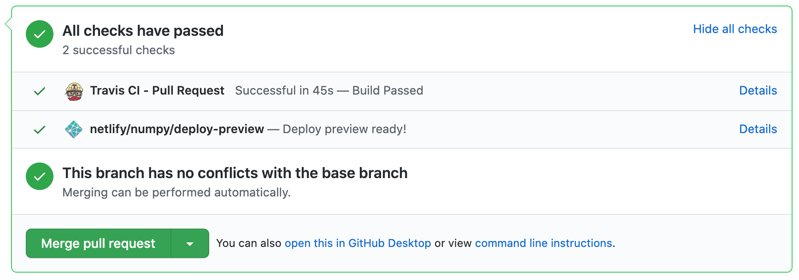

# Numpy.org

## Getting Started

To contribute to the website, you'll first need to install the *extended
version* of Hugo.

The Hugo [install page](https://gohugo.io/getting-started/installing/) has
instructions for different platforms and installers; make sure you end up with
the extended version.

On Linux it may be easiest to pick up a tarball of the latest extended version
from the [release page](https://github.com/gohugoio/hugo/releases/) and
install it per https://gohugo.io/getting-started/installing/#install-hugo-from-tarball.

Next, clone this repository, and install the theme:

```bash
git submodule update --init --recursive
```

The development web server is started with:

```bash
make serve
```

If you don't have `make` available (e.g., on Windows), use this instead:
```bash
python gen_config.py
hugo server
```

after which the site should be served at http://localhost:1313.

You'll see

```bash
error: failed to transform resource: TOCSS: failed to transform "style.sass"
```

if you don't have the Hugo extended version.


## User Experience (UX)

### NumPy Color Palette

 `RGB 1/50/67 | HEX #013243 | NumPy Warm Black`

 `RGB 77/119/207 | HEX #4D77CF | NumPy Deep Blue`

 `RGB 77/171/207 | HEX #4DABCF | NumPy Ndarray Blue`

 `RGB 108/122/137 | HEX #6C7A89 | NumPy Slate Gray`

 `RGB 238/238/238 | HEX #EEEEEE | NumPy Cloud Gray`

 `RGB 255/197/83 | HEX #FFC553 | NumPy Yellow`

 `RGB 255/255/255 | HEX #FFFFFF | White`


## Deployment

Submit pull requests first, those get run on [Netlify](https://quansight-labs.netlify.app/) and you can see a build preview by clicking on the `details` link at the bottom.
 


## Team lists

To update the teams gallery in numpy.org site, you need to run `make teams` Makefile target. It uses the `team_query.py` tool provided by [scientific-python-hugo-theme](https://github.com/scientific-python/scientific-python-hugo-theme). The following pre-requisites need to be met in numpy.org build environment:

* The `team_query.py` tool requires python requests package. Make sure it is installed in your numpy.org build environment before invoking `make teams` Makefile target.

* [GitHub token](https://docs.github.com/en/authentication/keeping-your-account-and-data-secure/creating-a-personal-access-token) with `read:org` permissions is required for requesting numpy.org team data from GitHub. The token has to be exported as `GH_TOKEN`.

```
export GH_TOKEN=xxxxxxxxxx
make teams
```

## Analytics

A self-hosted version of [Plausible.io](https://plausible.io) is used to gather simple
and privacy-friendly analytics for the site. The dashboard can be accessed
[here](https://views.scientific-python.org/numpy.org).
