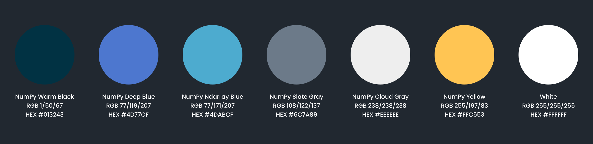

# Numpy.org

## **Getting Started**

To contribute effectively to this project, it's essential to set up your local development environment with the necessary tools. Below is a comprehensive guide to help you get started.

### 1. Install Hugo (Extended Version)

The website is powered by **Hugo**, a fast and flexible static site generator. To ensure you have access to all the necessary features for contributing to the project, you must install the **extended version of Hugo**. The extended version includes additional capabilities, such as enhanced image processing, which are critical for content optimization and functionality.

### Step-by-Step Installation:

- Visit the official [Hugo installation page](https://gohugo.io/getting-started/installing/) for detailed instructions on installing Hugo for various platforms.
- **Important**: Ensure that you specifically download the **extended version** of Hugo. The standard version does not include all the features required for this project, and using it may result in errors when running the deployment server or starting the application.

Once Hugo is installed, you can confirm that everything is set up correctly by checking the version:

```bash
hugo version
```

This command should return the installed version of Hugo, and it should reflect the extended version.

### 2. Clone the Repository and Install the Theme

With Hugo successfully installed, the next step is to set up the project repository and its theme.

- **Clone the repository** using Git:
    
    ```bash
    git clone https://github.com/your-username/your-repository.git
    ```
    
- **Install the theme** for the website by initializing the Git submodules:
    
    ```bash
    git submodule update --init --recursive
    ```
    

This will download and configure all the theme files necessary to render the website as intended.

### 3. Install `make` on Ubuntu

In order to run the `make serve` command and start the development server, you need to install `make` on your system. `make` is a tool used to automate and streamline processes, such as compiling code or serving the site.

### Steps to Install `make` on Ubuntu:

1. **Open your terminal**.
2. **Update the package list** to ensure your system is aware of the latest available versions:
    
    ```bash
    sudo apt update
    ```
    
3. **Install the `make` utility**:
    
    ```bash
    sudo apt install make
    ```
    
4. **Verify the installation** by checking the installed version of `make`:
    
    ```bash
    make --version
    ```
    

If `make` has been successfully installed, you should see the version information displayed in the terminal.

### 4. Starting the Development Server

Once you have completed the setup and installed all necessary dependencies, you're ready to start the local development server. On Ubuntu, you can do this using the `make serve` command, which is part of the project's Makefile.

Simply run the following command:

```bash
make serve
```

This will build and serve the website locally, allowing you to preview your changes. The site should now be accessible at: [**`*http://localhost:1313*`**](http://localhost:1313/)

### Alternative for Windows Users:

If you're using a platform like Windows and `make` is not available, you can run the following commands instead:

```bash
python gen_config.py
hugo server
```

Make sure you have the **extended version of Hugo installed** before running these commands.

### 5. Troubleshooting and Notes

- **Error Handling**: If you encounter any errors while running `make serve`, it is likely related to missing dependencies or an incorrect installation. Double-check that Hugo's extended version is installed and that all steps were followed.
- **Ensure Proper Theme Setup**: Missing theme files can also cause issues. Make sure to initialize the submodules correctly using `git submodule update --init --recursive`.

By following these steps, you should be all set to contribute to the project, make changes, and preview them locally.

## UI Color Palette

The website's design is grounded in a well-thought-out color palette, which contributes to its clean and professional aesthetic. Below is a detailed breakdown of the primary colors used on the site:



## Deployment

### Submitting Pull Requests


To deploy changes to the website, it is crucial to follow the standard workflow for submitting pull requests. Pull requests are automatically processed through Netlify, which handles the build and deployment process.

- **Build Preview**: After submitting your pull request, Netlify will trigger a build process. You can view the build preview by clicking on the "Details" link at the bottom of the pull request page.

### Updating the Teams Gallery

To update the teams gallery on the **numpy.org** website, use the `make teams` command. This process utilizes the `team_query.py` tool, which is provided by the **scientific-python-hugo-theme**.

### Pre-requisites:

1. **Python Requests Package**: The `team_query.py` tool requires the `requests` package. Ensure that the package is installed in your **numpy.org** build environment before executing the command.
    
    ```bash
    pip install requests
    ```
    
2. **GitHub Token**: A GitHub token with `read:org` permissions is required to fetch team data from GitHub. You must export the token as `GH_TOKEN` in your environment.
    
    ```bash
    export GH_TOKEN=xxxxxxxxxx
    ```
    
3. Once the above pre-requisites are set up, you can run the following command to update the teams gallery:
    
    ```bash
    make teams
    ```
    
This will pull the latest team information from GitHub and update the gallery on the website.

### Upgrading Hugo

To keep the project up to date, it's important to regularly upgrade Hugo. To upgrade Hugo, you need to change the version specified in the `netlify.toml` configuration file.

1. **Locate the `netlify.toml` file** in the project's root directory.
2. **Update the Hugo version** to the desired version by modifying the `hugoVersion` key in the configuration file.

After making the changes, commit the updates and push them to trigger a build on Netlify.

## Analytics

### Plausible Analytics

To gather simple and privacy-friendly analytics for the website, a self-hosted version of **Plausible.io** is used. Plausible provides insights into website traffic and user behavior while respecting user privacy.

- **Accessing the Dashboard**: The analytics dashboard can be accessed to review detailed insights about the website's performance and user interactions.

By using Plausible, the site adheres to modern privacy standards while still providing valuable metrics to improve the user experience.